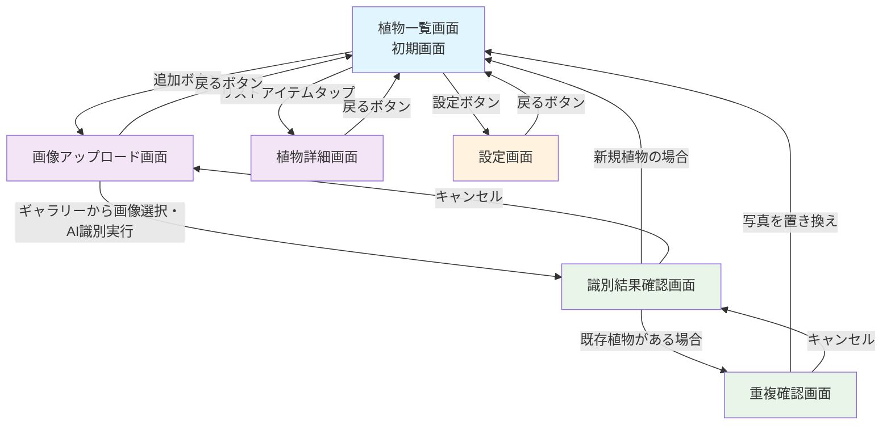

# SnapPlant 画面設計・ワイヤーフレーム

## 画面遷移図



## 各画面の詳細設計

### 1. 植物一覧画面（初期画面）

```
┌─────────────────────────────────────────┐
│   SnapPlant               [⚙] [+] │ ← ヘッダー (60px) + 設定・追加ボタン
├─────────────────────────────────────────┤
│ ┌───────┐                              │
│ │       │  桜                          │
│ │ 画像  │  春に美しいピンクの花を咲かせる  │ ← リストアイテム1
│ │       │                              │
│ └───────┘                              │
├─────────────────────────────────────────┤
│ ┌───────┐                              │
│ │       │  梅                          │
│ │ 画像  │  冬〜早春に芳香のある花を咲かせる │ ← リストアイテム2
│ │       │                              │
│ └───────┘                              │
├─────────────────────────────────────────┤
│ ┌───────┐                              │
│ │       │  菜の花                       │
│ │ 画像  │  春に黄色い花を咲かせ、畑や川土手 │ ← リストアイテム3
│ │       │  に見られる                     │
│ └───────┘                              │
├─────────────────────────────────────────┤
│              (以下同様...)               │
└─────────────────────────────────────────┘
```

**画面要素：**
- ヘッダー: アプリタイトル (高さ60px) + 設定ボタン + 追加ボタン(右隅)
- 植物リスト: 保存済み植物の一覧表示 (スクロール可能)
- 各リストアイテム: 画像サムネイル(80x80px)、植物名、特徴文

### 2. 画像アップロード画面

```
┌─────────────────────────────────────────┐
│ ← 戻る                                  │ ← 戻るボタン
├─────────────────────────────────────────┤
│                                         │
│        画像を選択してください            │ ← 説明テキスト
│                                         │
│    ┌─────────────────────────────┐      │
│    │                             │      │
│    │     タップして画像を選択      │      │ ← 画像選択エリア
│    │      (ギャラリーから)         │      │   (150px高さ)
│    │                             │      │
│    └─────────────────────────────┘      │
│                                         │
│    ┌─────────────────────────────┐      │
│    │                             │      │
│    │                             │      │
│    │      プレビューエリア         │      │ ← 選択後の
│    │     (画像選択後に表示)        │      │   プレビュー
│    │                             │      │   (200px高さ)
│    └─────────────────────────────┘      │
│                                         │
│                                         │
│           [植物を識別する]               │ ← 識別開始ボタン
│                                         │   (画像アップロード+AI識別実行)
└─────────────────────────────────────────┘
```

**画面要素：**
- 戻るボタン: 植物一覧画面へ戻る (左上)
- 説明テキスト: 操作説明 (中央上部)
- 画像選択エリア: ギャラリーアプリを起動 (点線枠、150px高さ)
- プレビューエリア: 選択した画像を表示 (200px高さ、選択後表示)
- 識別開始ボタン: 画像アップロード+AI識別を統合実行 (画像選択後に有効化)

### 3. 識別結果確認画面

```
┌─────────────────────────────────────────┐
│               識別結果                 │ ← ヘッダー
├─────────────────────────────────────────┤
│    ┌───────────────────┐              │
│    │                   │              │
│    │   識別した画像    │              │ ← 識別画像
│    │                   │              │   (120px高さ)
│    └───────────────────┘              │
├─────────────────────────────────────────┤
│                                         │
│ ● 桜 (サクラ)            信頼度: 95% │ ← 第1候補
│   バラ科 | 日本原産                    │   (選択中)
├─────────────────────────────────────────┤
│ ○ 桜桃 (オウトウ)          信頼度: 78% │ ← 第2候補
├─────────────────────────────────────────┤
│ ○ 梨 (ナシ)              信頼度: 65% │ ← 第3候補
├─────────────────────────────────────────┤
│                                         │
│        選択した植物の詳細情報        │ ← 詳細情報エリア
│    ・ 特徴: 春に美しい花を咲かせる     │
│    ・ 開花時期: 3月〜5月                 │
│    ・ 分布: 日本全国                     │
│                                         │
├─────────────────────────────────────────┤
│          [保存]    [キャンセル]          │ ← アクションボタン
└─────────────────────────────────────────┘
```

**画面要素：**
- ヘッダー: 識別結果タイトル
- 識別画像: 処理した画像を表示 (120px高さ)
- 識別結果リスト: 上位3候補と信頼度 (ラジオボタン形式)
- 詳細情報エリア: 選択した植物の基本情報
- アクションボタン: 保存またはキャンセル (並列配置)

### 4. 重複確認画面

```
┌─────────────────────────────────────────┐
│              重複確認                 │ ← ヘッダー
├─────────────────────────────────────────┤
│                                         │
│       同じ植物が見つかりました       │ ← 確認メッセージ
│                                         │
├─────────────────────────────────────────┤
│        既存の写真          新しい写真        │
│    ┌──────────────┐    ┌──────────────┐    │
│    │              │    │              │    │
│    │   保存済み   │    │   今回撮影   │    │ ← 写真比較エリア
│    │      桜      │    │      桜      │    │   (120x120px)
│    │              │    │              │    │
│    └──────────────┘    └──────────────┘    │
│                                         │
├─────────────────────────────────────────┤
│                                         │
│      どちらの写真を保存しますか？      │ ← 選択メッセージ
│                                         │
│    ● 既存の写真を保持する            │ ← 選択オプション
│    ○ 新しい写真に置き換える          │   (ラジオボタン)
│                                         │
├─────────────────────────────────────────┤
│          [保存]    [キャンセル]          │ ← アクションボタン
└─────────────────────────────────────────┘
```

**画面要素：**
- ヘッダー: 重複確認タイトル
- 確認メッセージ: 同じ植物が既に登録されている旨
- 写真比較エリア: 既存と新規写真を並列表示 (120x120px)
- 選択オプション: ラジオボタンで保持/置き換えを選択
- アクションボタン: 保存またはキャンセル

### 5. 植物詳細画面

```
┌─────────────────────────────────────────┐
│ ← 戻る                                 │ ← 戻るボタン
├─────────────────────────────────────────┤
│                                         │
│        ┌───────────────────────┐        │
│        │                       │        │
│        │                       │        │
│        │                       │        │
│        │      植物画像       │        │ ← 植物画像
│        │      (大きく表示)     │        │   (250x250px)
│        │                       │        │
│        │                       │        │
│        │                       │        │
│        └───────────────────────┘        │
│                                         │
├─────────────────────────────────────────┤
│                                         │
│   植物名: 桜 (サクラ)                   │ ← 植物情報エリア
│                                         │
│   信頼度: 95%                           │
│                                         │
│   特徴: 春に美しいピンクの花を咲かせる   │
│         日本を代表する花               │
│                                         │
│   科名: バラ科                           │
│                                         │
├─────────────────────────────────────────┤
│                                         │
│                 [削除]                  │ ← 削除ボタン
│                                         │
└─────────────────────────────────────────┘
```

**画面要素：**
- 戻るボタン: 植物一覧画面へ戻る (左上)
- 植物画像: 保存した画像を大きく表示 (250x250px)
- 植物情報エリア: 名前、信頼度、特徴、科名
- 削除ボタン: 植物データを削除 (下部中央)

### 6. 設定画面

```
┌─────────────────────────────────────────┐
│ ← 戻る           設定                   │ ← ヘッダー
├─────────────────────────────────────────┤
│                                         │
│          API設定                        │ ← セクションタイトル
│                                         │
├─────────────────────────────────────────┤
│ APIキー:                               │
│ ┌─────────────────────────────────────┐ │
│ │ ●●●●●●●●●●●●●●●●●●●●●●●●●       │ │ ← APIキー入力欄
│ └─────────────────────────────────────┘ │   (パスワード形式)
│                                         │
│ APIエンドポイント:                      │
│ ┌─────────────────────────────────────┐ │
│ │ https://func-snaplant-mk0w7s38.     │ │ ← エンドポイント入力欄
│ │ azurewebsites.net                   │ │
│ └─────────────────────────────────────┘ │
│                                         │
├─────────────────────────────────────────┤
│                                         │
│        [接続テスト]    [保存]           │ ← アクションボタン
│                                         │
├─────────────────────────────────────────┤
│                                         │
│          アプリ情報                     │ ← セクションタイトル
│                                         │
│  バージョン: 1.0.0                      │ ← アプリバージョン
│  開発者: SnapPlant Team                 │
│                                         │
├─────────────────────────────────────────┤
│                                         │
│          ヘルプ・サポート               │ ← セクションタイトル
│                                         │
│  > 使い方ガイド                         │ ← リンクアイテム
│  > よくある質問                         │
│  > お問い合わせ                         │
│                                         │
└─────────────────────────────────────────┘
```

**画面要素：**
- ヘッダー: 戻るボタン + 設定タイトル
- API設定セクション: 
  - APIキー入力欄 (セキュアテキスト、マスク表示)
  - APIエンドポイント入力欄 (プリフィル済み)
  - 接続テストボタン (API疎通確認)
  - 保存ボタン (設定保存)
- アプリ情報セクション: バージョン、開発者情報
- ヘルプ・サポートセクション: 各種リンク (将来実装)

## 画面遷移のパターン

### メインフロー（新規追加）

1. 植物一覧画面（起動）
2. → 画像アップロード画面（追加ボタンタップ）
3. → 識別結果確認画面（画像選択後、統合処理完了）
4. → 植物一覧画面（保存完了）

### 詳細確認フロー

1. 植物一覧画面
2. → 植物詳細画面（リストアイテムタップ）
3. → 植物一覧画面（戻るボタン）

### 設定フロー

1. 植物一覧画面
2. → 設定画面（設定ボタンタップ）
3. → 植物一覧画面（戻るボタンまたは保存後）

### キャンセルフロー

- 各画面からの戻る操作で前の画面に戻る
- 識別結果確認画面でキャンセルした場合は画像アップロード画面に戻る（画像は削除済み）
- 設定画面で保存せずに戻った場合、変更は破棄される
