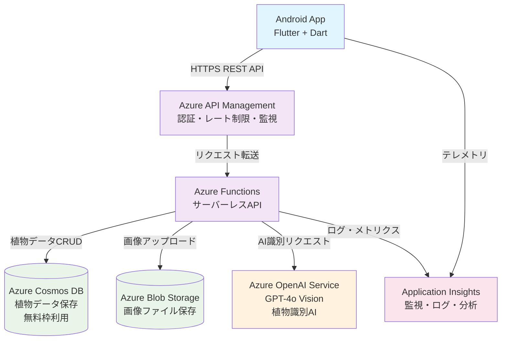

# SnapPlant 技術選定・アーキテクチャ設計書

## 1. 概要

植物図鑑アプリ「SnapPlant」のMVP版をAzureサービスを活用して構築するための技術選定とアーキテクチャ設計を行います。

## 2. アーキテクチャ概要図



## 3. 技術選定

### 3.1 フロントエンド（モバイルアプリ）

#### 選定：Flutter + Dart
- **理由**:
  - **UI品質**: Material Design 3.0による美しいネイティブ級UI
  - **パフォーマンス**: ネイティブコンパイルによる60fps保証
  - **画像処理**: 植物図鑑に最適な高速画像レンダリング
  - **アニメーション**: 滑らかな画面遷移とマイクロインタラクション
  - **クロスプラットフォーム**: iOS展開時の拡張性
  - **開発効率**: ホットリロードによる高速開発サイクル

#### 主要パッケージ
- **Flutter SDK**: 3.16.x (安定版)
- **Dart**: 3.2.x
- **flutter/material**: Material Design 3.0 UI
- **image_picker**: 画像選択・カメラ撮影
- **http**: HTTP通信・Azure API連携
- **shared_preferences**: 設定データ永続化
- **flutter_secure_storage**: APIキーのセキュア保存
- **cached_network_image**: 画像キャッシュ・表示最適化

### 3.2 バックエンド

#### 選定：Azure Functions (Node.js + TypeScript)
- **理由**:
  - サーバーレスでコスト効率が良い
  - 自動スケーリング
  - 開発・運用の簡易性
  - 従量課金でMVPに適している

#### Functions構成
- **HTTP Trigger**: REST API提供
- **Timer Trigger**: 定期処理（将来的なデータ整理等）
- **Blob Trigger**: 画像処理の非同期実行

### 3.3 データベース

#### 選定：Azure Cosmos DB (無料枠)
- **理由**:
  - **永続無料枠**: 1,000 RU/s + 25 GB ストレージ
  - MVPの小規模利用には十分
  - 自動スケーリング・高可用性
  - JSON形式でReact Nativeとの親和性が高い
  - グローバル分散可能

#### データ構造調整
```json
// plantsコンテナのドキュメント構造
{
  "id": "uuid",
  "name": "桜",
  "scientificName": "Prunus serrulata", 
  "familyName": "バラ科",
  "description": "詳細説明",
  "characteristics": "春に美しいピンクの花を咲かせる",
  "confidence": 95.5,
  "imagePath": "https://storage.../image.jpg",
  "createdAt": "2024-01-15T10:30:00Z",
  "updatedAt": "2024-01-15T10:30:00Z"
}
```

### 3.4 画像ストレージ

#### 選定：Azure Blob Storage (Hot Tier)
- **理由**:
  - 大容量画像ファイルの効率的な保存
  - CDN連携可能
  - REST API経由でのアクセス
  - コスト効率が良い

### 3.5 植物識別AI

#### 選定：OpenAI Vision API (GPT-4 Vision)
- **理由**:
  - 高精度な画像認識・植物識別能力
  - 専門知識による詳細な植物情報提供
  - REST API経由での利用
  - Azure OpenAI ServiceまたはOpenAI APIで利用可能
  - カスタムプロンプトによる柔軟な応答制御

### 3.6 API管理・セキュリティ

#### MVP段階：Azure Functions 標準機能
- **認証方式**: Function Key認証
  - 追加コストなし（APIMの月額¥7,000を回避）
  - 個人開発に適した単純な認証
  - クエリパラメータでの認証（`?code={key}`）

- **セキュリティ対策**:
  - HTTPS通信強制（Azure Functions標準）
  - CORS設定による呼び出し元制限
  - Application Insightsでの監視・ログ

#### 将来検討：Azure API Management
- **移行タイミング**: 商用化・大規模化時
- **追加機能**: レート制限、高度な認証、API バージョニング

### 3.7 監視・ログ

#### 選定：Azure Application Insights
- **機能**:
  - アプリケーション パフォーマンス監視
  - エラー追跡
  - ユーザー行動分析
  - カスタムイベント追跡

## 4. 詳細技術仕様

### 4.1 Azure Functions 構成

#### API エンドポイント設計
```typescript
// GET /api/plants - 植物一覧取得
// GET /api/plants/{id} - 植物詳細取得
// POST /api/plants - 植物新規登録
// PUT /api/plants/{id} - 植物情報更新
// DELETE /api/plants/{id} - 植物削除
// POST /api/identify - 植物識別
```

#### 使用パッケージ
- **@azure/functions**: Azure Functions ランタイム
- **@azure/cosmos**: Cosmos DB接続
- **@azure/storage-blob**: Blob Storage操作
- **openai**: OpenAI Vision API連携
- **multer**: ファイルアップロード処理

### 4.2 Flutter アプリ構成

#### フォルダ構造
```
lib/
├── main.dart              # アプリエントリーポイント
├── models/                # データモデル・型定義
│   ├── plant.dart
│   ├── identification_result.dart
│   └── api_response.dart
├── screens/               # 画面ウィジェット
│   ├── plant_list_screen.dart
│   ├── camera_screen.dart
│   ├── identification_screen.dart
│   ├── plant_detail_screen.dart
│   └── settings_screen.dart
├── widgets/               # 共通ウィジェット
│   ├── plant_card.dart
│   ├── identification_card.dart
│   └── custom_app_bar.dart
├── services/              # API通信・ビジネスロジック
│   ├── api_service.dart
│   ├── storage_service.dart
│   └── camera_service.dart
├── utils/                 # ユーティリティ関数
│   ├── constants.dart
│   ├── helpers.dart
│   └── validators.dart
├── theme/                 # テーマ・スタイル
│   ├── app_theme.dart
│   └── colors.dart
└── navigation/            # 画面遷移管理
    └── app_router.dart
```

#### セキュリティ関連パッケージ
- **shared_preferences**: 設定データ保存
- **flutter_secure_storage**: APIキーのセキュア保存
- **connectivity_plus**: ネットワーク状態監視

#### API通信設定
- **http package**: REST API通信
- **認証**: Function Keyをクエリパラメータで送信
- **エラーハンドリング**: 401認証エラーの適切な処理
- **リトライ機能**: ネットワークエラー時の自動再試行
- **JSON変換**: dart:convert による型安全なシリアライゼーション

### 4.3 データフロー

#### 植物識別フロー
1. **認証確認**: 設定画面からAPIキー取得（flutter_secure_storage）
2. **画像選択**: Flutter image_picker → 画像選択・撮影
3. **画像アップロード**: Flutter http → Azure Functions → Blob Storage (Function Key認証)
4. **AI識別**: Azure Functions → Azure OpenAI Service → GPT-4o Vision (SAS URL対応)
5. **結果表示**: API Response → Flutter UI (Material Design)
6. **データ保存**: Flutter → Azure Functions → Cosmos DB (Function Key認証)

#### 認証フロー
1. **初回設定**: ユーザーが設定画面でAPIキー入力
2. **セキュア保存**: flutter_secure_storage にキーを暗号化保存
3. **API呼び出し**: 全リクエストでクエリパラメータに認証キー付与
4. **エラー処理**: 401エラー時は設定画面への誘導（Navigator.push）

## 5. コスト見積もり（月額・東日本リージョン）

### 5.1 MVP段階（月間100ユーザー想定）
- **Azure Functions**: ¥500-800
- **Azure Cosmos DB**: **¥0** (無料枠内)
- **Azure Blob Storage (Hot)**: ¥200-400
- **Azure API Management (Developer)**: ¥4,500
- **OpenAI Vision API**: ¥1,500-3,000
- **Application Insights**: ¥300-500

**月額合計**: 約¥6,500-7,200 (**¥600-800の節約**)

### 5.2 成長段階（月間1,000ユーザー想定）
- **Azure Cosmos DB**: 無料枠超過で¥1,000-2,000追加
- その他サービスのスケールアップが必要
- **月額合計**: 約¥12,000-15,000

## 6. 開発・デプロイ戦略

### 6.1 CI/CD パイプライン

#### 選定：Azure DevOps
- **Azure Pipelines**: ビルド・テスト・デプロイ自動化
- **Azure Repos**: ソースコード管理（GitHubとの連携も可能）

#### デプロイフロー
```
開発者 → Git Push → Azure Pipelines → 
自動テスト → Azure Functions Deploy → 
Cosmos DB Setup → 完了
```

### 6.2 環境構成
- **開発環境**: ローカル + Azure Dev/Test サブスクリプション
- **ステージング環境**: Azure（本番同等構成）
- **本番環境**: Azure（高可用性構成）

## 7. セキュリティ設計

### 7.1 認証・認可

#### MVP段階: Azure Function Key認証
- **選定理由**:
  - Azure Functionsの標準機能で追加実装不要
  - アプリ設定画面でのユーザー管理が可能
  - 個人開発に適したシンプルな認証方式
  - API呼び出し時のクエリパラメータで認証

- **実装方式**:
  ```
  GET /api/plants?code={FUNCTION_KEY}
  POST /api/plants/identify?code={FUNCTION_KEY}
  ```

- **キー管理**:
  - Azure Portalでの手動生成・取得
  - モバイルアプリの設定画面で設定
  - React Native Keychainでのセキュア保存

#### 将来拡張: Azure Active Directory B2C
- **段階的移行計画**:
  - Phase 1: Function Key（MVP）
  - Phase 2: ユーザー登録・ログイン機能追加時にAAD B2C導入
  - Phase 3: OAuth 2.0 / OpenID Connect対応

- **HTTPS通信**: 全API通信の暗号化必須

### 7.2 データ保護
- **Azure Cosmos DB**: 保存時暗号化・ネットワーク暗号化
- **Azure Blob Storage**: アクセス制御・暗号化
- **Application Insights**: 個人情報のマスキング

## 8. 将来拡張性

### 8.1 スケーラビリティ対応
- **Azure Functions Premium Plan**: 高負荷時の対応
- **Azure Cosmos DB**: 無料枠から有料プランへの移行・自動スケーリング
- **Azure Content Delivery Network**: グローバル配信

### 8.2 機能拡張
- **プッシュ通知**: Azure Notification Hubs
- **リアルタイム通信**: Azure SignalR Service
- **機械学習強化**: Azure Machine Learning

## 9. リスク評価

### 9.1 技術リスク
- **OpenAI Vision API**: APIコストと利用制限
- **React Native**: ネイティブ機能制限
- **Azure Functions**: コールドスタート問題

### 9.2 対策
- **コスト最適化**: Azure OpenAI Serviceの利用検討
- **ハイブリッド開発**: 必要に応じてネイティブコード併用
- **Premium Plan**: パフォーマンス要件に応じた移行