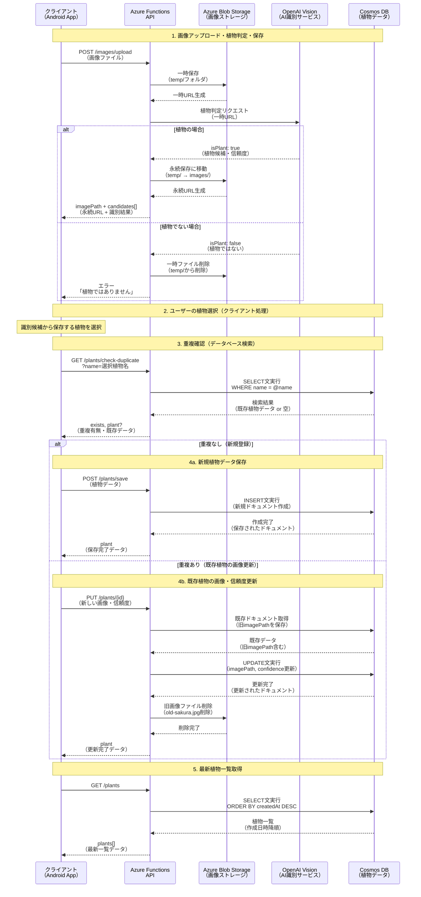
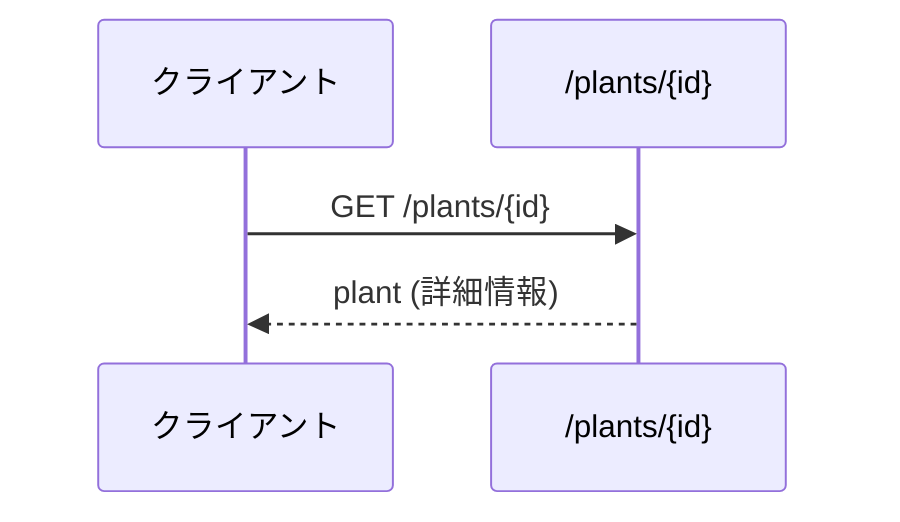
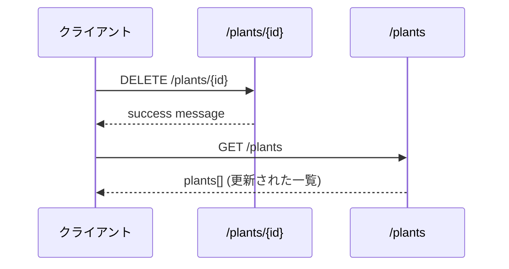

# SnapPlant APIワークフロー設計書

## 1. 概要

植物図鑑アプリ「SnapPlant」におけるAPI呼び出しの実行順序とデータフローを定義します。
ユーザーが画像をアップロードしてから植物一覧で確認されるまでの完全なワークフローを示します。

## 2. メインワークフロー：植物登録フロー

### 2.1 システム全体フロー図



### 2.2 データ更新詳細

各APIでどのストレージに何が保存・更新されるかの詳細：

| API | ストレージ | 操作 | 更新内容 |
|-----|-----------|------|----------|
| `POST /images/upload` | **Blob Storage**<br/>**OpenAI Vision** | CREATE<br/>READ | ①一時保存→植物判定→永続保存 or 削除<br/>②画像解析・植物識別実行 |
| `GET /plants/check-duplicate` | **Cosmos DB** | READ | name条件でのドキュメント検索（データ変更なし） |
| `POST /plants/save` | **Cosmos DB** | CREATE | 新規植物ドキュメントを作成・保存 |
| `PUT /plants/{id}` | **Cosmos DB**<br/>**Blob Storage** | UPDATE<br/>DELETE | ①既存ドキュメントのimagePath・confidenceを更新<br/>②旧画像ファイルを削除（ゴミファイル防止） |
| `GET /plants` | **Cosmos DB** | READ | 全植物ドキュメントの取得（データ変更なし） |

### 2.3 ストレージ状態変化

#### ステップ1処理中: Blob Storageの状態変化

**①一時保存:**
```
Azure Blob Storage Container: temp
├── 12345678-uuid-1.jpg  ← 一時保存
└── existing-temp-files.jpg
```

**②植物判定結果による分岐:**

**植物の場合（永続保存）:**
```
Azure Blob Storage Container: images
├── 12345678-uuid-1.jpg  ← temp/から移動
├── 87654321-uuid-2.jpg  
└── existing-files.jpg

Azure Blob Storage Container: temp
└── existing-temp-files.jpg  ← 対象ファイルは削除済み
```

**植物でない場合（削除）:**
```
Azure Blob Storage Container: temp
└── existing-temp-files.jpg  ← 対象ファイル削除済み

※ images/コンテナには何も追加されない
```

#### ステップ4a後: Cosmos DB新規保存の状態
```json
// 新規ドキュメントが追加される
{
  "id": "123e4567-e89b-12d3-a456-426614174000",  ← 新規作成
  "name": "桜",
  "imagePath": "https://snaplant.blob.core.windows.net/images/12345678-uuid-1.jpg",
  "confidence": 95.5,
  "createdAt": "2024-01-15T10:30:00Z",  ← 新規作成
  "updatedAt": "2024-01-15T10:30:00Z"   ← 新規作成
}
```

#### ステップ4b後: Cosmos DB更新 + Blob Storage削除の状態

**Cosmos DB:**
```json
// 既存ドキュメントが更新される
{
  "id": "123e4567-e89b-12d3-a456-426614174000",   // 変更なし
  "name": "桜",                                    // 変更なし
  "imagePath": "https://snaplant.blob.core.windows.net/images/12345678-uuid-1.jpg", ← 更新
  "confidence": 95.5,                             ← 更新（85.0→95.5）
  "createdAt": "2024-01-10T14:20:00Z",           // 変更なし
  "updatedAt": "2024-01-15T10:30:00Z"            ← 更新
}
```

**Blob Storage:**
```
Azure Blob Storage Container: images
├── 12345678-uuid-1.jpg  ← 新しい画像（残存）
├── 87654321-uuid-2.jpg  
└── existing-files.jpg   

// old-sakura.jpg は削除済み（ゴミファイル削除）
```

### 2.4 ステップ詳細

#### ステップ1: 画像アップロード・植物判定・保存
```http
POST /api/images/upload?code={FUNCTION_KEY}
Content-Type: multipart/form-data

{file: [binary data]}
```

**レスポンス（植物の場合）:**
```json
{
  "success": true,
  "data": {
    "imagePath": "https://snaplant.blob.core.windows.net/images/12345678-uuid.jpg",
    "fileName": "plant.jpg",
    "contentType": "image/jpeg",
    "fileSize": 1048576,
    "identificationResult": {
      "isPlant": true,
      "confidence": 95.5,
      "candidates": [
        {
          "name": "桜",
          "scientificName": "Prunus serrulata",
          "familyName": "バラ科",
          "description": "日本を代表する花木",
          "characteristics": "春に美しいピンクの花を咲かせる",
          "confidence": 95.5
        }
      ]
    }
  }
}
```

**レスポンス（植物でない場合）:**
```json
{
  "success": false,
  "error": {
    "code": "NOT_A_PLANT",
    "message": "アップロードされた画像は植物ではありません",
    "details": "植物の画像を選択して再度お試しください"
  }
}
```

#### ステップ3: 重複確認
```http
GET /api/plants/check-duplicate?name=桜&code={FUNCTION_KEY}
```

**レスポンス（重複なし）:**
```json
{
  "success": true,
  "data": {
    "exists": false
  }
}
```

**レスポンス（重複あり）:**
```json
{
  "success": true,
  "data": {
    "exists": true,
    "plant": {
      "id": "123e4567-e89b-12d3-a456-426614174000",
      "name": "桜",
      "imagePath": "https://snaplant.blob.core.windows.net/images/old-sakura.jpg",
      "confidence": 85.0,
      "createdAt": "2024-01-10T14:20:00Z"
    }
  }
}
```

#### ステップ4a: 新規植物保存（重複なしの場合）
```http
POST /api/plants/save?code={FUNCTION_KEY}
Content-Type: application/json

{
  "name": "桜",
  "scientificName": "Prunus serrulata",
  "familyName": "バラ科",
  "description": "日本を代表する花木",
  "characteristics": "春に美しいピンクの花を咲かせる",
  "confidence": 95.5,
  "imagePath": "https://snaplant.blob.core.windows.net/images/12345678-uuid.jpg"
}
```

#### ステップ4b: 既存植物更新（重複ありの場合）
```http
PUT /api/plants/123e4567-e89b-12d3-a456-426614174000?code={FUNCTION_KEY}
Content-Type: application/json

{
  "imagePath": "https://snaplant.blob.core.windows.net/images/12345678-uuid.jpg",
  "confidence": 95.5
}
```

**処理詳細：**
1. 既存ドキュメント取得（旧imagePathを保存）
2. ドキュメント更新（新しいimagePath・confidence）
3. 旧画像ファイル削除（`old-sakura.jpg`削除）
4. レスポンス返却

**レスポンス:**
```json
{
  "success": true,
  "data": {
    "plant": {
      "id": "123e4567-e89b-12d3-a456-426614174000",
      "name": "桜",
      "imagePath": "https://snaplant.blob.core.windows.net/images/12345678-uuid.jpg",
      "confidence": 95.5,
      "updatedAt": "2024-01-15T10:30:00Z"
    }
  }
}
```

#### ステップ5: 植物一覧取得
```http
GET /api/plants?code={FUNCTION_KEY}
```

**レスポンス:**
```json
{
  "success": true,
  "data": {
    "plants": [
      {
        "id": "123e4567-e89b-12d3-a456-426614174000",
        "name": "桜",
        "characteristics": "春に美しいピンクの花を咲かせる",
        "imagePath": "https://snaplant.blob.core.windows.net/images/12345678-uuid.jpg",
        "confidence": 95.5,
        "createdAt": "2024-01-15T10:30:00Z"
      }
    ],
    "total": 1
  }
}
```

## 3. サブワークフロー

### 3.1 植物詳細表示フロー



### 3.2 植物削除フロー



## 4. エラーハンドリングパターン

### 4.1 各ステップでのエラー処理

#### ステップ1エラー: 画像アップロード・AI識別失敗
```json
// アップロードエラー
{
  "success": false,
  "error": {
    "code": "STORAGE_ERROR",
    "message": "画像のアップロードに失敗しました"
  }
}

// AI識別エラー
{
  "success": false,
  "error": {
    "code": "AI_SERVICE_ERROR", 
    "message": "植物識別サービスでエラーが発生しました"
  }
}

// 植物ではない場合
{
  "success": false,
  "error": {
    "code": "NOT_A_PLANT",
    "message": "アップロードされた画像は植物ではありません"
  }
}
```
**対応**: ユーザーに再アップロードを促す

#### ステップ3エラー: 重複確認失敗
```json
{
  "success": false,
  "error": {
    "code": "DATABASE_ERROR",
    "message": "データベースに接続できません"
  }
}
```
**対応**: 重複確認をスキップして新規保存を試行

#### ステップ4エラー: 保存/更新失敗
```json
// 新規保存失敗
{
  "success": false,
  "error": {
    "code": "INTERNAL_ERROR",
    "message": "植物の保存に失敗しました"
  }
}

// 更新失敗（旧画像削除失敗含む）
{
  "success": false,
  "error": {
    "code": "INTERNAL_ERROR",
    "message": "植物の更新に失敗しました",
    "details": "旧画像の削除に失敗しましたが、データ更新は完了しています"
  }
}
```
**対応**: データの再送信または後で再試行

## 5. パフォーマンス考慮事項

### 5.1 実行時間見積もり

| ステップ | 想定時間 | 重要度 |
|---------|---------|-------|
| 1. 画像アップロード | 2-5秒 | 高 |
| 2. AI植物識別 | 3-8秒 | 最高 |
| 3. 重複確認 | 0.1-0.5秒 | 中 |
| 4. 保存/更新 | 0.2-1秒 | 高 |
| 5. 一覧取得 | 0.1-0.5秒 | 中 |

**総実行時間**: 約5-15秒

### 5.2 最適化ポイント

1. **並列処理**: ステップ2の識別処理中にステップ3の重複確認を並行実行可能
2. **キャッシュ活用**: 一覧データのクライアントサイドキャッシュ
3. **プログレス表示**: 長時間処理のユーザーフィードバック
4. **リトライ機能**: ネットワークエラー時の自動再試行

## 6. 実装上の注意点

### 6.1 状態管理

- 各ステップの実行状態をクライアントで適切に管理
- エラー発生時の状態リセット処理
- 途中キャンセル時のクリーンアップ処理

### 6.2 セキュリティ

- 全てのAPI呼び出しでFunction Key認証を実施
- アップロードファイルの形式・サイズ検証
- XSS対策としてのレスポンスデータサニタイズ

### 6.3 ユーザビリティ

- 各ステップでの適切なローディング表示
- エラー時の分かりやすいメッセージ表示
- 長時間処理の途中キャンセル機能

## 7. テストシナリオ

### 7.1 正常系テスト

1. **完全フロー**: 画像アップロード → 識別 → 重複なし → 新規保存 → 一覧確認
2. **重複フロー**: 画像アップロード → 識別 → 重複あり → 画像更新 → 一覧確認
3. **キャンセルフロー**: 各ステップでのキャンセル操作

### 7.2 異常系テスト

1. **ネットワークエラー**: 各ステップでの通信障害
2. **サービス障害**: AI識別サービス、データベース障害
3. **不正データ**: 無効な画像、不正なリクエストデータ

### 7.3 パフォーマンステスト

1. **大容量画像**: 制限値ギリギリの画像ファイル
2. **同時実行**: 複数ユーザーの同時利用
3. **長時間実行**: 識別処理の最大実行時間

## 8. 運用監視

### 8.1 メトリクス

- 各ステップの成功率・実行時間
- エラー発生頻度・種別
- ユーザーの離脱ポイント

### 8.2 アラート

- AI識別サービスの応答時間異常
- データベース接続エラー急増
- 画像アップロード失敗率上昇

このワークフロー設計書により、SnapPlant APIの実行順序と各ステップの詳細が明確になり、フロントエンド実装・テスト設計・運用監視の指針となります。